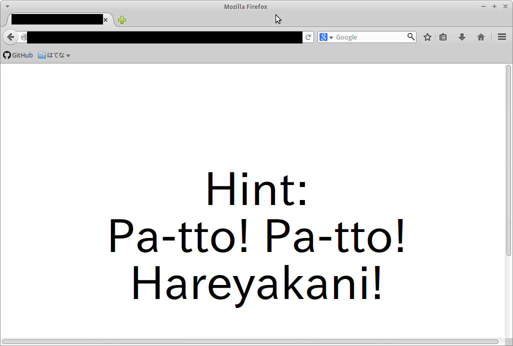

#解答編

昨日に投稿した記事の読み方です。

##-1. 環境

Xubuntu 14.04。色んなものAPTで入れてるからかなりカオスになってる。

GCC,GFortranは4.8.2で、Rubyは2.1.2、Pythonは2.7.6と3.4.0。Node.jsは0.11.13だったと思います。

##0. zipファイルを落としてくる

[ここ](https://gist.github.com/alucky0707/b35c5a5aa6f54b7faebb)にも書いておきましたが、これは普通に落としてくるだけです。

```bash
# git clone https://gist.github.com/b35c5a5aa6f54b7faebb.git seccamp2014 && cd seccamp2014
Cloning into 'seccamp2014'...
remote: Counting objects: 28, done.
remote: Compressing objects: 100% (27/27), done.
remote: Total 28 (delta 0), reused 20 (delta 0)
Unpacking objects: 100% (28/28), done.
Checking connectivity... done.
# unzip seccamp2014.zip
Archive:  seccamp2014.zip
  inflating: seccamp2014.py          
```

すると`seccamp2014.py`というファイルができると思います。

ちなみにこのファイルを素直にPython(2.x、3.xどちらでも実行できます）として実行すると……、

```bash
# python seccamp2014.py > seccamp2014.2.py
# diff seccamp2014.py seccamp2014.2.py
```

Quineになっています。


##1. Rubyとして実行する→7zファイルの取得

さて、`seccamp2014.py`を素直にPythonとして実行してもQuineなので、あまり意味がありません。なので、少しコードを眺めてみます。

`seccamp2014.py（冒頭部分）`

```python
__END__=0;s=1//2or'''/.to_s[1..0].gsub(/^$/){require'base64';Base64.decode64 (([*DATA][3..-2]*'').tr("lkjhgfdsamnbvcxzpoiuytrewq","qwertyuiopasdfghjklzxcvbnm"))}.display.to_i.succ
__END__
=1;'use strict';$=+[];____=$++;___$=$++;__$_=$++;__$$=$++;_$__=$++;_$_$=$++;_$$_=$++;_$$$=$++;$___=$++;$__$=$++;$_=({}+$)[_$_$]+({}+$)[___$]+([][$]+[])[___$]+(!$+[])[__$$]+({}+[])[_$$_]+(!!$+[])[___$]+(!!$+[])[__$_]+({}+$)[_$_$]+({}+[])[_$$_]+({}+[])[___$]+(!!$+[])[___$];$$=$[$_][$_];$$($$((!!$+[])[___$]+(!!$+[])[__$$]+(!!$+[])[____]+(!!$+[])[__$_]+(!!$+[])[___$]+$_[__$_]+'"'+([][$]+[])[_$_$]+(!$+[])[____]+'\\'+____+_$_$+____+(!!$+[])[____]+'\\'+___$+_$$$+___$+'\\'+___$+_$$_+____+(!!$+[])[__$$]+$_[___$]+(!$+[])[____]+'\\'+____+_$__+____+(!!$+[])[__$$]+$_[__$_]+$_[____]+(!!$+[])[___$]+'\\'+___$+_$$$+___$+'\\'+___$+_$$_+____+(!!$+[])[____]+(!!$+[])[__$$]+([][$]+[])[__$_]+（まだまだ続く）
```

何となくですが、1行目の`to_s`とか`require`からしてRubyのように見えませんか？

というわけでRubyとして実行してみます。すると、

```bash
# ruby seccamp2014.py
```

何だかバイナリのようなものが一気に出力されたと思います。さすがに全体を吐かれてもわけが分からないので適当に先頭の100byteくらい見てみると、

```bash
# ruby seccamp2014.py | head -c100
```

とかすると`7z`という文字が見えるので多分7zip形式のアーカイブなんじゃないかと当たりを付けて保存します。

で、`7z`コマンドで解凍を試みるのですが……。

```bash
# ruby seccamp2014.py > seccamp2014.7z
# 7z x seccamp2014.7z
Processing archive: seccamp2014.7z

Enter password (will not be echoed) :
```

パスワードの入力を求められました。次はこのパスワード探しです。


##Node.jsで実行→ブラウザで実行→パスワードのヒントを取得

もう一度ソースコードをよく観察してみます。すると`'use strict';`や`function`からJavaScriptとしても実行できるのではないかと推測できます。

というわけでとりあえずNode.jsで実行してみると、

```bash
# node seccamp2014.py
$ cp seccamp2014.py seccamp2014.html && open seccamp2014.html
```

何やらコマンドラインらしき文字列が出力されました。これを、少し変えて（HTMLをブラウザで開く的な意味で`open`コマンドが使えるのはOS Xとかなので）実行してみます。

```bash
# cp seccamp2014.py seccamp2014.html && xdg-open seccamp2014.html
```

すると次のようなページが開きます。



「Hint: Pa-tto! Pa-tto! Hareyakani!」と表示されていますね。

「ぱーっとぱーっと晴れやかに」と言ったらハナヤマタしかないので、先程の7zのパスワードに「hanayamata」と入力してみます。

```
# 7z x seccamp2014.7z
Processing archive: seccamp2014.7z

Enter password (will not be echoed) :hanayamata

Extracting  seccamp2014.gz,v

Everything is Ok

Size:       32148
Compressed: 32025
```

というわけで`seccamp2014.7z`が解凍されて、`seccamp2014.gz,v`というファイルが現れました。


##`gz,v`って何の拡張子だよ

`gz,v`というか末尾に`,v`が付いているものはRCSといういにしえのバージョン管理システムのファイルになります。

バージョン管理システムというと、最近で言えばGitとかMercurialみたいなものですね。

とりあえずログを見てみます。

```bash
# rlog seccamp2014.gz

RCS file: seccamp2014.gz,v
Working file: seccamp2014.gz
head: 1.3
branch:
locks: strict
access list:
symbolic names:
keyword substitution: o
total revisions: 3;	selected revisions: 3
description:
Compressed file
----------------------------
revision 1.3
date: 2014/08/20 01:44:46;  author: alucky0707;  state: Exp;  lines: +1 -115
Third version
----------------------------
revision 1.2
date: 2014/08/20 01:44:46;  author: alucky0707;  state: Exp;  lines: +115 -1
Second version
----------------------------
revision 1.1
date: 2014/08/20 01:44:46;  author: alucky0707;  state: Exp;
Initial revision
=============================================================================
```

何だか色々出てきましたが、ぱっと見て`1.1`、`1.2`、`1.3`という3つのリビジョンがあり、`1.1`から`1.2`になるときに`+115`行されていることなんかが分かります。

まあ行が増えてる方が正解かなーと（実際は試行錯誤するかもしれない）考えて、リビジョン`1.2`のファイルを取り出して、解凍します。

```bash
# co -l1.2 seccamp2014.gz
# gzip -cd seccamp2014.gz
program seccamp2014
  implicit none
（まだまだ続く）
```

出てきたファイルはどうもFortran 95っぽいです。`implicit none`って言ったらFortranですよね？


##Fortranとしてコンパイルして実行→C言語でコンパイルして実行

というわけでFortranとしてコンパイルして実行します。

```bash
# gzip -cd seccamp2014.gz > seccamp2014.f90
# gfortran -o seccamp2014f seccamp2014.f90
# ./seccamp2014f
const char main[] =
（まだまだ続く）
```

するとC言語っぽいソースコードが出てくるので、今度はC言語としてコンパイルして実行します。

```bash
# ./seccamp2014f > seccamp2014.c
# .gcc -o seccamp2014c seccamp2014.c
# ./seccamp2014c
```

これでMarkdownっぽいファイル——つまり私のセキュリティ・キャンプの参加記が取り出せるはずです。

一つ注意するべき点は、`seccamp2014.f90`は少なくともリトルエンディアンで32bit以上な環境じゃないと上手く動かないと思うのと（私はx86\_64なLinuxでしか試してません）、`seccamp2014.c`は機械語をハードコーディングしているので間違いなくx86\_64なLinuxじゃないと動かないと思います。


##感想

考えたネタはなるべく実装しようと思ったので公開までに結構時間がかかってしまいました。

本当はもっと色々やってみたいことがあったのですが……（最初のpolyglotコードの言語数を増やしたり）。

ちなみに、私が知る範囲で解読してくださったのは[@tyage]氏だけでした。誰も解読してくれなかったらどうしようと思っていたので、読んでくださる方がいてよかったです、ありがとうございます。

以下、解読された`text.md`です。

{TEXTMD}


[@tyage]: https://twitter.com/tyage
